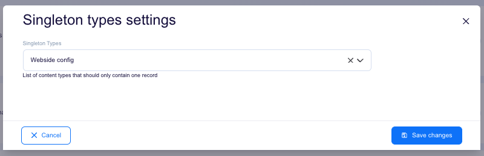
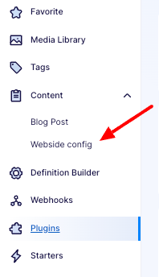

[[_TOC_]]

# Singleton types

## Usage

Select content types that should only contain one record.



Now when you click on the types selected in the plugin configuration you will be taken directly to the edit or add page
of Content object



> **Warning**: Using the plugin does not change the way the API manages objects

## Quick start

1. `yarn` - to install dependencies
2. `yarn start` - to start development mode - rebuild on file modifications
3. update your `plugin-manifest.json` file to contain the production URL and other plugin information
4. `yarn build` - to build plugins

## Dev environment

Dev environment is configured to use:

* `prettier` - best used with automatic format on save in IDE
* `eslint` - it is built into both `start` and `build` commands

## Output

The plugins are built into a single `dist/index.js` file. The manifest is copied to `dist/plugin-manifest.json` file.

## Deployment

<!-- TO DO -->

## Loading the plugin

**Warning:** While developing, you can use  `https://localhost:3053/plugin-manifest.json` address to load the plugin
manifest. Make sure your browser trusts the local certificate on the latter, to be able to use it e.g.
with `https://editor.flotiq.com`

### URL

**Hint**: You can use localhost url from development mode `https://localhost:3053/index.js`

1. Open Flotiq editor
2. Open Chrome Dev console
3. Execute the following script
   ```javascript
   FlotiqPlugins.loadPlugin('plugin-id', '<URL TO COMPILED JS>')
   ```
4. Navigate to the view that is modified by the plugin

### Directly

1. Open Flotiq editor
2. Open Chrome Dev console
3. Paste the content of `dist/index.js`
4. Navigate to the view that is modified by the plugin

### Deployment

**Hint**: You can use localhost url from development mode `https://localhost:3053/plugin-manifest.json`

1. Open Flotiq editor
2. Add a new plugin and paste the URL to the hosted `plugin-manifest.json` file
3. Navigate to the view that is modified by the plugin
